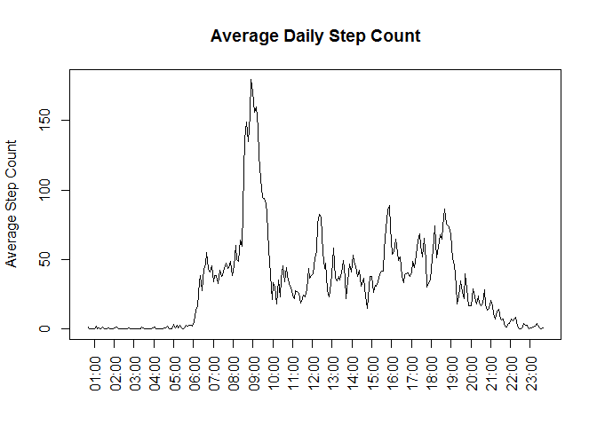

# Reproducible Research: Peer Assessment 1


## Loading and preprocessing the data

the below methods loads the CSV file from the activity zip file
and trasforms the date fild into Date

```r
readData <- function() {
    #source file name
    fileName <- "activity.zip"
    #get path of temporary directory
    tmpDir <- tempdir()
    #extract CSV file name from Zip file
    csvFileName <- unzip(fileName,list=TRUE)$Name[1]
    #unzip csv file into temporary direct
    unzip(fileName, file=csvFileName, exdir = tmpDir, overwrite = TRUE)
    #get full path of CSV file
    csvFullPath <- file.path(tmpDir, csvFileName)
    #read CSV file
    data <- read.csv(csvFullPath)
    #transform date column into Date
    data$date <- as.Date(data$date)
    #return value
    data
}
```
The function's return values will be sotred in a variable named "data"


```r
data <- readData()
```


## What is mean total number of steps taken per day?

I've used tapply to calculate total daily steps


```r
daily_totals <- tapply(data$steps, data$date, sum, na.rm=TRUE)
```


```r
##Below code block generates a histogram of daily step
hist(daily_totals, xlab="Total Daily Steps", ylab="Frequency", main="Total number of steps taken each day")
```


```r
##mean and median  daily steps were calculated from the daily_totals variable
mean(daily_totals)
```

```
## [1] 9354.23
```

```r
median(daily_totals)
```

```
## [1] 10395
```

## What is the average daily activity pattern?

Below plot shows average daily step count by time segments

```r
#will be used for string padding
library(stringr)
#calculate total number of steps per time segment divided by the unique number of days. this to overcome missing values
average_daily_pattern <- tapply(data$steps, data$interval, sum, na.rm=TRUE) / length(unique(data$date))
#create a time vector for x axis
hours <- paste(str_pad(1:23, 2, pad='0'), ':00', sep='')
#plot
plot(average_daily_pattern, type="l", xaxt='n', xlab='', ylab='Average Step Count', main='Average Daily Step Count')
#add x axis
axis(side = 1, at=((0:22) * 12.5) + 5,labels = hours, las=2)
```


Blow is calculation and representation of most active daily time segment

```r
#extract interval having max average daily step count
maxStepTime <- names(average_daily_pattern)[average_daily_pattern == max(average_daily_pattern)]
#format time
maxStepTime <- paste(str_pad(as.integer(as.integer(maxStepTime) / 100), 2, pad='0'), str_pad(as.integer(as.integer(maxStepTime) %% 100), width=2, pad='0'), sep=':')
maxStepTime
```

```
## [1] "08:35"
```


## Imputing missing values

Total number of NAs in dataset

```r
is_na = sum(is.na(data))
is_na
```

```
## [1] 2304
```

Handling NAs:
I would have replaced all missing values with the median step count for time segment

Below code block creates a new data set that is equals to the original one but all NAs are replaced with the median number of steps per interval

```r
#Generate a dataframe holding the median number of steps per interval
medValues <- as.data.frame(cbind(interval = unique(data$interval), steps = tapply(data$steps, data$interval, median, na.rm=T)))
#generate new data set
dataNoNA<- rbind(
    #all non na
    data[is.na(data$steps) == F, ],
    #all na values replaced by their median
    merge(medValues, data[is.na(data$steps) == T, 2:3], by.x ="interval", by.y = "interval")[, c(2, 3, 1)]
)
```

Calculate the daily totals from the dataNoNA varaible and display an histogram

```r
daily_totals_no_na <- tapply(dataNoNA$steps, dataNoNA$date, sum)
##Below code block generates a histogram of daily step
hist(daily_totals_no_na, xlab="Total Daily Steps", ylab="Frequency", main="Total number of steps taken each day")
```


```r
##Calculate and report the mean and median total number of steps taken per day. Do these values differ from the estimates from the first part of the assignment?
mean_median <- data.frame(mean = c(mean(daily_totals_no_na), mean(daily_totals)), median = c(median(daily_totals_no_na), median(daily_totals)))
rownames(mean_median) <- c('NA as median', 'Original Data')
mean_median
```

```
##                   mean median
## NA as median  9503.869  10395
## Original Data 9354.230  10395
```
There is no real difference from the estimates in  the first part of assignemnt


###What is the impact of imputing missing data on the estimates of the total daily number of steps?
The histogram shape has not changed. it seems like the frequencies went a litle higher than before.
It seems like we could just ignore the NA observations.

## Are there differences in activity patterns between weekdays and weekends?

```r
#add a weekday / weekend column
dataByWeekdayWeekEnd <- cbind(data, c("weekday", "weekend")[as.numeric(weekdays(data$date) %in% c("Sunday", "Saturday")) +
1])
names(dataByWeekdayWeekEnd)[4] <- "day"

library(reshape2)
#group and melt results
stepsByWeekdayDay <- melt(tapply(dataByWeekdayWeekEnd$steps, list(dataByWeekdayWeekEnd$day, dataByWeekdayWeekEnd$interval), mean, na.rm=T))

#set names
names(stepsByWeekdayDay) <- c("day", "interval", "steps")

#plot
library("lattice")
plot <- xyplot(steps ~ interval | factor(day), data=stepsByWeekdayDay, 
       type = 'l',
       main="Average Number of Steps Taken \n bY Weekday Days / Weekend Days",
       xlab="5 Minute Intervals",
       ylab="Average Number of Steps Taken",
       layout=(c(1,2)))
print (plot) 
```


